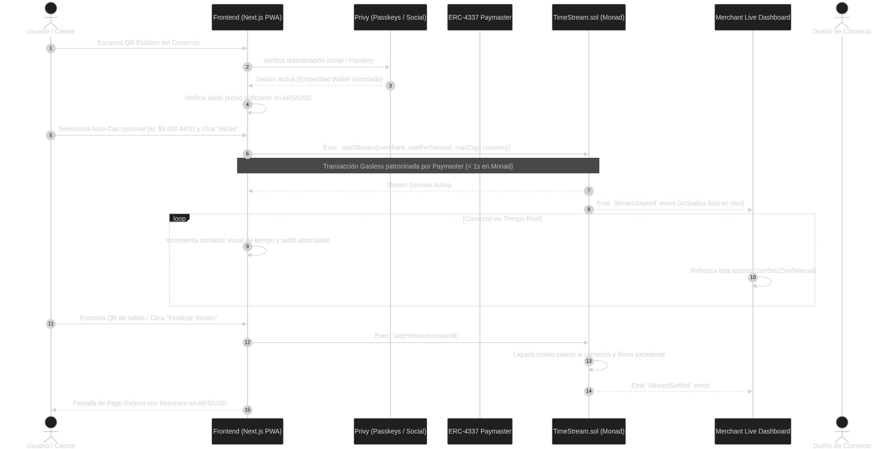
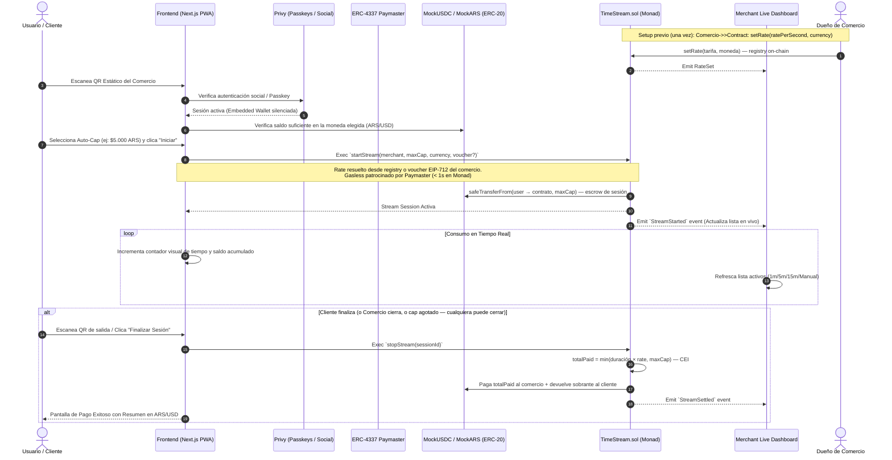
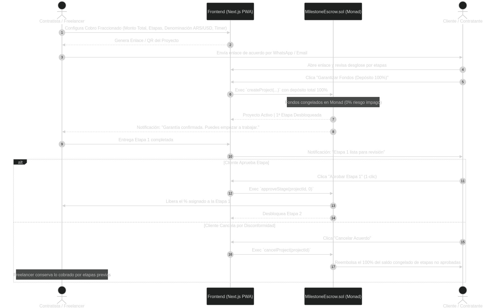
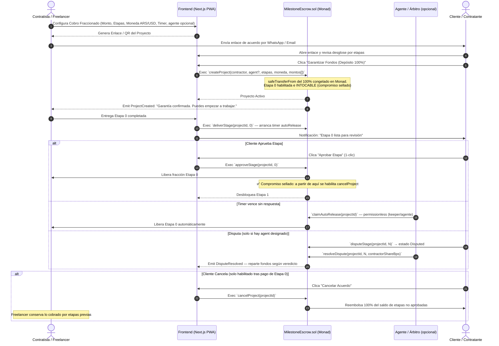
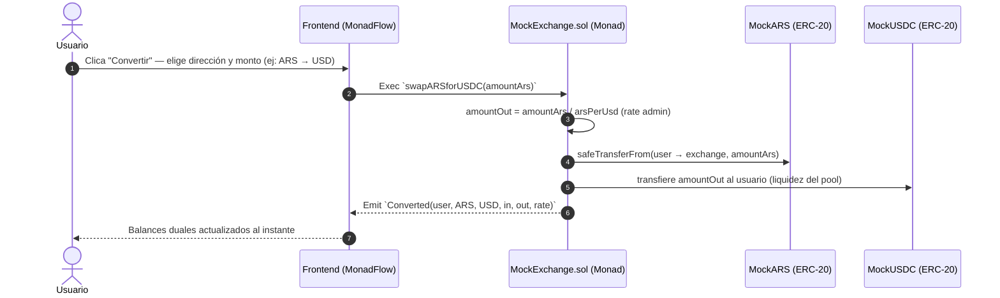
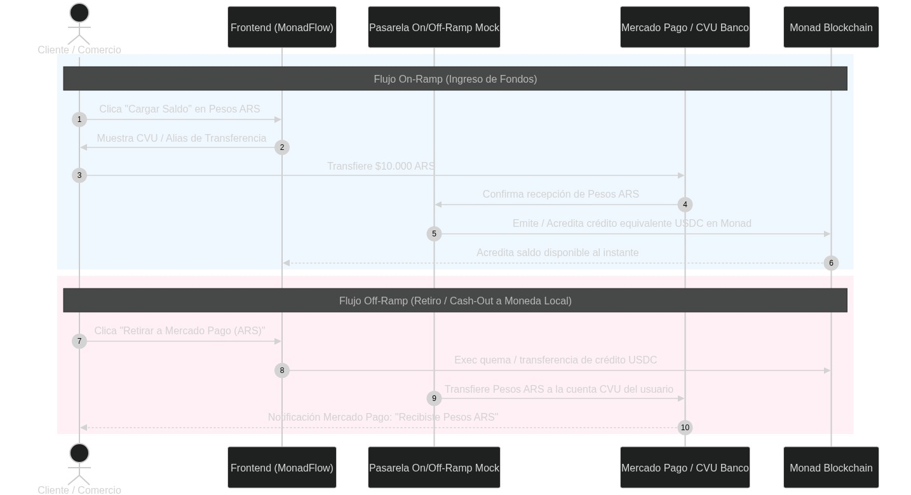
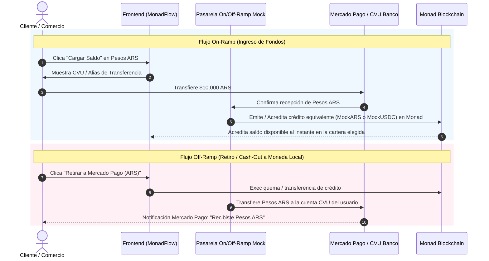

# Diagramas de Secuencia del Sistema (MonadFlow)

Este documento especifica los flujos de interacción del sistema mediante diagramas Mermaid interactivos y sus versiones exportadas individualmente en formato de imagen PNG y SVG para ambos modos de pago, la conversión multimoneda y la pasarela Fiat en MonadFlow.

> **Versión 2.0** — Flujos actualizados al spec v2: escrow de `maxCap` al iniciar stream, tarifa desde registry/voucher del comercio, `deliverStage` como disparador del timer, política de Etapa 0 intocable, disputas con agente y conversión ARS↔USD vía `MockExchange`.

---

## 🟢 1. Diagrama de Secuencia: Modo 1 (Pay-per-use Stream / Check-in QR)

Este flujo describe cómo un cliente escanea un QR en un comercio (gimnasio, coworking, sala de ensayo), congela un límite propio (Auto-Cap) en escrow y consume tiempo con liquidación exacta al cierre — sin costo de gas visible.

### 🖼️ Imagen del Diagrama

*Archivos de imagen:* [PNG](images/modo_1_pay_per_use_stream.png) | [SVG](images/modo_1_pay_per_use_stream.svg)
*⚠️ Nota: regenerar imágenes con el flujo v2 (escrow + registry de tarifa).*

---

## 🔵 2. Diagrama de Secuencia: Modo 2 (Milestone-Lock Escrow / Contratistas)

Este flujo describe cómo un profesional/freelancer crea un acuerdo por partes, el cliente deposita el 100% en custodia congelada upfront, el contratista entrega cada hito on-chain (lo que arranca el timer), y las reglas de Etapa 0 intocable, cancelación y disputa con agente.

### 🖼️ Imagen del Diagrama

*Archivos de imagen:* [PNG](images/modo_2_milestone_lock_escrow.png) | [SVG](images/modo_2_milestone_lock_escrow.svg)
*⚠️ Nota: regenerar imágenes con el flujo v2 (deliverStage + etapa 0 + disputa).*

---

## � 3. Diagrama de Secuencia: Conversión Multimoneda (ARS ↔ USD)

El usuario mantiene dos carteras (Pesos y Dólares) dentro de su cuenta y puede convertir entre ellas en cualquier momento vía `MockExchange`.

---

## �💳 4. Diagrama de Secuencia: Pasarela Fiat (ARS ↔ USDC)

Este flujo describe la conversión transparente entre Pesos Argentinos (Mercado Pago / CVU) y saldo en Monad.

### 🖼️ Imagen del Diagrama

*Archivos de imagen:* [PNG](images/pasarela_fiat_ars_usdc.png) | [SVG](images/pasarela_fiat_ars_usdc.svg)

---

## 🔗 Archivos Relacionados (Obsidian Graph)
- [Contexto Maestro](../00_System/CONTEXTO_MAESTRO.md)
- [Reglas de Agentes](../00_System/REGLAS_AGENTES.md)
- [Modelado de Smart Contracts](Modelado_SmartContracts.md)
- [Transferencias P2P (Modo 3)](Transferencias_P2P.md)
- [Integración Frontend](Integracion_Frontend.md)
- [Spec Agente Orquestador](../06_Agent_Orchestrator/SPEC_ORQUESTADOR.md)
- [Backlog Smart Contracts](../02_SmartContracts_Terminal/TASK_BACKLOG.md)
- [Backlog Frontend](../03_Frontend_Terminal/TASK_BACKLOG.md)
